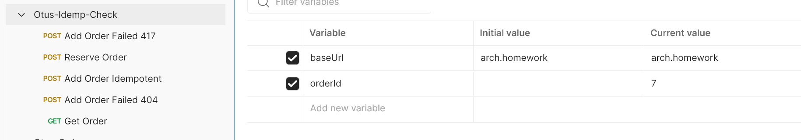

# Otus 07
Идемпотентность
# Результат выполнения задания
Студент: Дмитриев С.А. Группа OTUS MicroserviceArchitecture-2023-04

## Описание
Использую nfinx-ingress. Порт 32083.
Данные об аутентификации храню в памяти в сервисе аутентификации.
### Использованный паттерн идемпотентности
1. Клиент обращается в сервис с просьбой зарезервировать Id. POST /order/reserve
2. Сервис создает в БД в таблице Orders запись с идентификатором и остальными пустыми полями и возвращает этот Id клиенту.
3. Клиент заполняет Заказ и проставляет в него полученный Id.
4. Клиент отправляет в сервис заполненный заказ с проставленным Id. POST /order
5. Сервис сверяет полученный заказ с записью в БД с указанным в заказе Id, и если в БД поле Product is null, тогда сохраняет заказ в БД.
6. Если поле Product в БД уже заполнено, то сервис считает пришедший заказ дублем и ничего не делает. А возвращает код 201 created. Таким образом достигаем идемпотентности.
7. Если сервис получает Заказ с пустым Id, то возвращает ошибку 417 Expectation Failed.
8. Если сервис получает Заказ с не существующим в БД Id, то возвращает ошибку 404 Not Found.

## Процесс выполнения:
1. Создал неймспейс zipper
```shell
kubectl apply -f kube-manifest/01_namespace_zipper.yaml
```
2. Установил PostgreSql в неймспейс zipper
```shell
helm install postgresql-test oci://registry-1.docker.io/bitnamicharts/postgresql --set auth.database=mydb,auth.postgresPassword=secretpassword -n zipper
```
3. Написал свой сервис сохранения заказов на Java (my-order-worker-service)
4. Установил приложение с помощью Helm в неймспейс zipper.
```shell
helm install order-worker-local myapp/. -n zipper
5. Сделал коллекцию postman для проверки предложенного сценария (Otus-Idemp-Check.json)
Для тестирования сделал проброс порта:
```shell
kubectl port-forward --namespace nginx-ingress svc/ingress-nginx-controller 8080:80 --address 127.0.0.1,192.168.1.191
```
```shell
newman run Otus-Idemp-Check.json --verbose
```


Всё.
